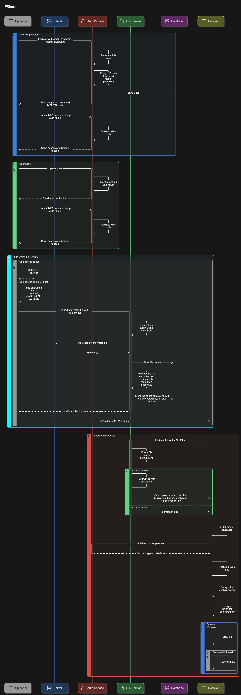

# **FShare - File Sharing Application**

FShare is a secure and robust file-sharing application that enables users to upload, share, and manage encrypted files. It includes a **Django backend** (server) for handling API requests and business logic, and a **React/Vite frontend** (client) for the user interface.

---

## **Table of Contents**

- [Setup Instructions](#setup-instructions)
  - [Running with Docker](#running-with-docker)
  - [Running Locally](#running-locally)
    - [Backend Setup](#backend-setup-django-server)
    - [Frontend Setup](#frontend-setup-react-client)
- [Application Workflow](#application-workflow)
- [API Access](#api-access)
- [Troubleshooting](#troubleshooting)

---

## **Setup Instructions**

### **Running with Docker**

The project includes a Docker setup for running both the client and server simultaneously.

1. **Setup Environment Variables**:

- In the project root, copy `.env.example` to `.env`:

  ```bash
  cp .env.example .env
  ```

- Update the `.env` file with appropriate values. Here are some sample values:

  ```bash
  ### this .env is used for docker compose

  # CLIENT ENV VARIABLES
  VITE_API_URL="http://localhost:8000"

  # SERVER ENV VARIABLES
  SECRET_KEY="EB585CAE79C5716B446A8506D6E81313" # 32 bytes key used to encrypt mfa secret
  SERVER_FILE_ENCRYPTION_KEY="A17FB154FC9BD982C137515C9DC36216" # 32 bytes for AES-256. used for encrypting files
  MFA_JWT_SECRET_KEY="369FD1B0BFC1C6070DAF41FD490BE641963B17E5A93108070F7AD04BAC4504D9" # secret key used to generate temporary jwt tokens for mfa registration
  AUTH_JWT_SECRET_KEY="1B7FD022D3499C0BCBE8D9CB1EE0C97594B2491BEB86C28380731C46D294EF28" # secret key used to generate login auth tokens
  DEBUG_MODE="False" # True or False
  ALLOWED_HOSTS="localhost,127.0.0.1" # allowed hosts used in settings.py
  CORS_ALLOWED_ORIGINS="http://localhost:5173,http://127.0.0.1:5173,http://localhost,https://localhost" # allowed hosts used in settings.py
  ```

- Please generate unique keys at the time of running the application for better security
  ```bash
  openssl enc -aes-128-cbc -k secret -P -md sha1 # generates 32 bytes key
  ```

2. **Custom certificates for SSL/TLS**

- The client docker image by default creates a self signed SSL certificate with a validity of 1 year

- To overwrite the certificate that comes with the docker image:

  - Create a `certs` folder in the root of the project

    ```bash
    mkdir certs
    ```

  - Generate self signed SSL certificates

    ```bash
    openssl req -x509 -nodes -days 365 -newkey rsa:2048 \
      -keyout certs/server.key -out certs/server.crt \
      -subj "/CN=localhost"
    ```

  - Add `volumes` to `client` service pointing to the `certs` folder:

    ```bash
    volumes:
        - ./certs/server.crt:/etc/nginx/certs/server.crt
        - ./certs/server.key:/etc/nginx/certs/server.key
    ```

3. **Build and Run the Docker Containers**:

- From the project root directory, run:

  ```bash
  docker compose up --build
  ```

4. **Access the application**:

- Frontend: `https://localhost`

- Backend: `http://localhost:8000`

5. **Create super user for Django admin**:

- To create a super user for accessing the admin portal:

  ```bash
  docker exec -it <backend_container_id> sh
  ```

  ```bash
  python manage.py createsuperuser
  ```

- Don't use this admin user as a normal application user as the RSA keys and master password will not be generated.

6. **Promoting Regular User to Admin Role**

- When a regular user signs up using the application's registration flow, the user can be converted to an `Admin` through the admin panel (`http://localhost:8000/admin`) using the previously created admin user's credentials.

- Note: The admin panel workaround is required only for the first `Regular User` to be converted to `Admin` role.

- Now the newly converted `Admin` role user can change the roles of any other user who registers in the application.

---

### **Running Locally**

#### **Backend Setup (Django Server)**

1. **Create a Virtual Environment**:

```bash
python -m venv .venv
source .venv/bin/activate  # On Windows use `.venv\Scripts\activate`
```

2. **Navigate to the Server Directory**:

```bash
cd server
```

3. **Install Dependencies**:

```bash
pip install --upgrade pip
pip install -r requirements.txt
```

4. **Setup Environment Variables**:

- Copy `.env.example` to `.env`:

  ```bash
  cp .env.example .env
  ```

- Update the `.env` file with appropriate values. Here are some sample values:

  ```bash
  SECRET_KEY="EB585CAE79C5716B446A8506D6E81313" # 32 bytes key used to encrypt mfa secret
  SERVER_FILE_ENCRYPTION_KEY="A17FB154FC9BD982C137515C9DC36216" # 32 bytes for AES-256. used for encrypting files
  MFA_JWT_SECRET_KEY="369FD1B0BFC1C6070DAF41FD490BE641963B17E5A93108070F7AD04BAC4504D9" # secret key used to generate temporary jwt tokens for mfa registration
  AUTH_JWT_SECRET_KEY="1B7FD022D3499C0BCBE8D9CB1EE0C97594B2491BEB86C28380731C46D294EF28" # secret key used to generate login auth tokens
  DEBUG_MODE="False" # True or False
  ALLOWED_HOSTS="localhost,127.0.0.1" # allowed hosts used in settings.py
  CORS_ALLOWED_ORIGINS="http://localhost:5173,http://127.0.0.1:5173,http://localhost,https://localhost" # allowed hosts used in settings.py
  ```

- Please generate unique keys at the time of running the application for better security

  ```bash
  openssl enc -aes-128-cbc -k secret -P -md sha1 # generates 32 bytes key
  ```

5. **Apply Migrations**:

```bash
python manage.py migrate
```

6. **Create a super user to access the Django admin portal**:

```bash
python manage.py createsuperuser
```

Don't use this admin user as a normal application user as the RSA keys and master password will not be generated.

7. **Promoting Regular User to Admin Role**

- When a regular user signs up using the application's registration flow, the user can be converted to an `Admin` through the admin panel (`http://localhost:8000/admin`) using the previously created admin user's credentials.

- Note: The admin panel workaround is required only for the first `Regular User` to be converted to `Admin` role.

- Now the newly converted `Admin` role user can change the roles of any other user who registers in the application.

8. **Start the Server**:

```bash
python manage.py runserver
```

The backend will be available at `http://127.0.0.1:8000/`.

---

#### **Frontend Setup (React/Vite Client)**

1. **Navigate to the Client Directory**:

```bash
cd client
```

2. **Install Dependencies**:

```bash
npm install
```

3. **Setup Environment Variables**:

- Copy `.env.example` to `.env`:

  ```bash
  cp .env.example .env
  ```

- Update the `.env` file with appropriate values. Here are some sample values:

  ```bash
  VITE_API_URL="http://localhost:8000"
  ```

- Please generate unique keys at the time of running the application for better security

4. **Start the Frontend Development Server**:

```bash
npm run dev
```

The frontend will be available at `http://localhost:5173/`.

---

## **Application Workflow**

The following sequence diagram ilustrates the flow of the application:



It shows how the client and server interact during user registration, user login, file upload and file sharing workflows.

---

## **API Access**

To test backend endpoints, use tools like Postman or curl.
Example endpoint for login:

```bash
POST http://127.0.0.1:8000/api/auth/login/
```

For full API documentation, refer to the backend `urls.py`.

---

## **Troubleshooting**

### **Backend Issues**:

- Verify that the `.env` file exists and contains correct values.

- Check database migrations:

  ```bash
  python manage.py showmigrations
  python manage.py migrate
  ```

### **Frontend Issues**:

- Ensure the `VITE_API_URL` matches your backend server URL.

- Restart the frontend development server:

  ```bash
  npm run dev
  ```

### **Docker Issues**:

- If volumes are not persisting, ensure permissions are correct for `server/data` and `server/media`.

- Rebuild containers to apply changes:

  ```bash
  docker-compose down --volumes
  docker-compose up --build
  ```

---

You’re now ready to run and develop FShare locally or using Docker! 🚀
